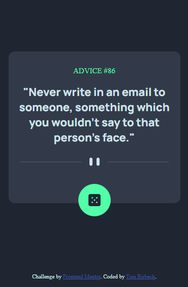

# Frontend Mentor - Advice generator app solution

This is a solution to the [Advice generator app challenge on Frontend Mentor](https://www.frontendmentor.io/challenges/advice-generator-app-QdUG-13db). Frontend Mentor challenges help you improve your coding skills by building realistic projects.

## Table of contents

- [Overview](#overview)
  - [The challenge](#the-challenge)
  - [Screenshot](#screenshot)
  - [Links](#links)
- [My process](#my-process)
  - [Built with](#built-with)
  - [What I learned](#what-i-learned)
- [Author](#author)

## Overview

Recreate this image for a mobile screen:

### The challenge

Users should be able to:

- View the optimal layout for the app depending on their device's screen size
- See hover states for all interactive elements on the page
- Generate a new piece of advice by clicking the dice icon

### Screenshot

Here is my attempt:

### Links

- Solution URL: [Frontend Mentor solution link](https://www.frontendmentor.io/solutions/advice-generator-mobile-design-C7umd5YkMz)
- Live Site URL: [Live site](https://tombirbeck.github.io/frontend-mentor-advice-generator-app/)

## My process

Firstly I set the width to 375px as that was the suggested size then I used a border-box box-sizing to make sure I could easily control the element sizes. I then set the default padding and margins to 0 before importing the font and setting up custom variables for the colours.\
I gave the body a display of flex, with a flex-direction of column with a justify-content of center to create the layout required.\
The next step was to build out the card using a div with p-elements for the advice id and advice quote, with a span in the advice id element so that I could change that with each new piece of advice. I brought in the border image and placed it below where the advice will go and the created the button element and wrapped it around the dice icon image provided to get the correct look. I used a relative position for the button so that it sits half in, half out of the card element.\
At this point I created a main.js file captured the html elements I need in variables and declared an aysnc getQuote function. When called this function sets the text content for the advice id and the advice itself.\
I called the function in the file so that when the page is loaded a piece of advice will automatically appear and then added an event listener so that the function would be called when the button was clicked.

### Built with

- Semantic HTML5 markup
- CSS custom properties
- JavaScript
- Flexbox
- Mobile-first workflow
- API

### What I learned

This was a good challenge to go over custon CSS properties, consuming an API and relative positioning.

## Author

- Portfolio - [Tom Birbeck](https://portfolio-tombirbeck.vercel.app/)
- Frontend Mentor - [TomBirbeck](https://www.frontendmentor.io/profile/TomBirbeck)
